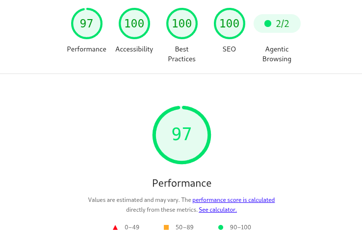
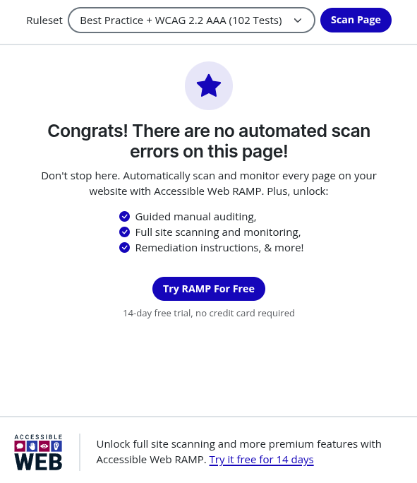

<h1 align="center">💼 Portfólio | Laís Reis</h1>

Portfólio desenvolvido para apresentar meus projetos, habilidades e experiência em UI/UX Design e Desenvolvimento Front-end.

  

## 📖 Sobre

Este portfólio foi desenvolvido para reunir meus principais projetos, apresentar minha trajetória profissional e demonstrar minhas habilidades em UI/UX Design e Desenvolvimento Front-end.

O foco do projeto foi criar uma experiência moderna, responsiva e acessível, aplicando boas práticas de desenvolvimento, princípios de usabilidade e atenção aos detalhes da interface.

## 🛠 Tecnologias

Este projeto foi desenvolvido utilizando tecnologias web modernas, sem frameworks, priorizando organização, desempenho e manutenção do código.

## ✨ Funcionalidades

- Layout responsivo
- Navegação intuitiva
- Menu Mobile
- Scroll suave
- Animações
- Links para redes sociais
- Projetos em destaque
- Boas práticas de acessibilidade
- Estrutura semântica para SEO

## ⚡ Performance e Acessibilidade

O projeto foi otimizado para alcançar excelentes métricas de desempenho e acessibilidade utilizando boas práticas de design e desenvolvimento web.

### Lighthouse

### Accessible Web

## 🚀 Demonstração

Você pode visualizar a versão publicada do meu portfólio através do link abaixo.

👉 https://laisreis.vercel.app/

> O site está hospedado no Vercel.

## 🎨 Processo de Design

Durante o desenvolvimento foram considerados princípios de UX e UI, como:

- Hierarquia visual
- Grid Layout
- Espaçamento consistente
- Contraste e legibilidade
- Responsividade
- Acessibilidade (WCAG)
- Design centrado no usuário

## 🚀 Demonstração

A versão publicada do projeto está disponível em:

🌐 **https://laisreis.vercel.app/**

> Hospedado na Vercel.

## Destaques do projeto

- Desenvolvido com HTML, CSS e JavaScript puro, sem frameworks.
- Estrutura semântica para melhor acessibilidade e SEO.
- Layout totalmente responsivo para desktop, tablet e dispositivos móveis.
- Otimização de imagens e recursos para carregamento rápido.
- Foco em boas práticas de UX, legibilidade e navegação intuitiva.